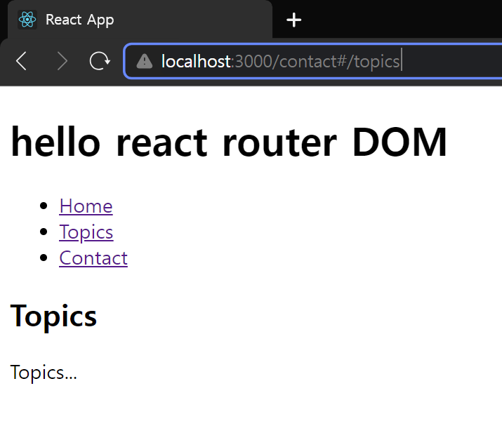

# Ch 03. React Router DOM (2)

# Link

### `Link`

단일 페이지 애플리케이션(Single Page Application)에서 페이지가 reload 되지 않고 동적으로 가져오는 데이터는 비동기적으로 가져와서 페이지를 만들 때 사용하는 컴포넌트

a 태그 대신 아래와 같이 사용할 수 있다.

```jsx
import { BrowserRouter, Route, Routes, Link } from "react-router-dom";
...

function App() {
  return (
    <div>
      <h1>hello react router DOM</h1>
      <ul>
        <li>
          <Link to="/">Home</Link>
        </li>
        <li>
          <Link to="/topics">Topics</Link>
        </li>
        <li>
          <Link to="/contact">Contact</Link>
        </li>
      </ul>
      {/* react-router-dom v5에서는 Switch 컴포넌트를 사용하고, v6 이상에서는 Routes 컴포넌트를 사용 */}
      <Routes>
        <Route path="/" element={<Home />} />
        <Route path="/topics" element={<Topics />} />
        <Route path="/contact" element={<Contact />} />
        <Route path="*" element={<div>Not Found</div>} />
      </Routes>
    </div>
  );
}
...
```

### `HashRouter`

사용자가 어떤 Path로 들어와도 동일한 웹 페이지를 서비스 할 수 있도록 웹 서버를 설정해야 한다.

BrouserRouter를 HashRouter로 변경한다.  

```jsx
import { HashRouter, Route, Routes, Link } from "react-router-dom";
...
root.render(
  <HashRouter>
    <App />
  </HashRouter>,
  document.getElementById("root")
);
...
```



위와 같이 주소창에 Hash#가 붙으며 JS 상에서 처리되는 북마크가 생성된다. (웹 페이지에서 해시 이후는 무시한다.)

### `NavLink`

```jsx
import { HashRouter, Route, Routes, NavLink } from "react-router-dom";
...
function App() {
  return (
    <div>
      <h1>hello react router DOM</h1>
      <ul>
        <li>
          <NavLink to="/">Home</NavLink>
        </li>
        <li>
          <NavLink to="/topics">Topics</NavLink>
        </li>
        <li>
          <NavLink to="/contact">Contact</NavLink>
        </li>
      </ul>
      {/* react-router-dom v5에서는 Switch 컴포넌트를 사용하고, v6 이상에서는 Routes 컴포넌트를 사용 */}
      <Routes>
        <Route path="/" element={<Home />} />
        <Route path="/topics" element={<Topics />} />
        <Route path="/contact" element={<Contact />} />
        <Route path="*" element={<div>Not Found</div>} />
      </Routes>
    </div>
  );
}
```

아래와 같이 출력되는 컴포넌트에 `class="active"`이 생긴다. 


`/contact` 주소일 때 `/`에도 매칭되는 것을 막기 위해 **exact** 속성을 추가할 수 있다.

```jsx
      <ul>
        <li>
          <NavLink exact to="/">Home</NavLink>
        </li>
        <li>
          <NavLink to="/topics">Topics</NavLink>
        </li>
        <li>
          <NavLink to="/contact">Contact</NavLink>
        </li>
      </ul>
```

# Nested Routing

```jsx

function Topics() {
  return (
    <div>
      <h2>Topics</h2>
      <ul>
        <li>
          <NavLink to="/topics/1">html</NavLink>
        </li>
        <li>
          <NavLink to="/topics/2">js</NavLink>
        </li>
        <li>
          <NavLink to="/topics/3">react</NavLink>
        </li>
      </ul>
      <Routes>
        <Route path="/topics/1" element={<div>html is...</div>} />
        <Route path="/topics/2" element={<div>js is...</div>} />
        <Route path="/topics/3" element={<div>react is...</div>} />
      </Routes>
    </div>
  );
}

```

```jsx
function Topics() {
  return (
    <div>
      <h2>Topics</h2>
      <ul>
        <li>
          <NavLink to="/topics/1">html</NavLink>
        </li>
        <li>
          <NavLink to="/topics/2">js</NavLink>
        </li>
        <li>
          <NavLink to="/topics/3">react</NavLink>
        </li>
      </ul>
    </div>
  );
}

function App() {
  return (
    <div>
      <h1>hello react router DOM</h1>
      <ul>
        <li>
          <NavLink to="/">Home</NavLink>
        </li>
        <li>
          <NavLink to="/topics">Topics</NavLink>
        </li>
        <li>
          <NavLink to="/contact">Contact</NavLink>
        </li>
      </ul>
      <Routes>
        <Route path="/" element={<Home />} />
        <Route path="/topics/*" element={<Topics />} />
        <Route path="/contact" element={<Contact />} />
        <Route path="*" element={<div>Not Found</div>} />

        <Route path="/topics/1" element={<div><Topics />html is...</div>} />
        <Route path="/topics/2" element={<div><Topics />js is...</div>} />
        <Route path="/topics/3" element={<div><Topics />react is...</div>} />
      </Routes>
    </div>
  );
}
```

```jsx
import React from "react";
import { createRoot } from "react-dom/client";
import "./index.css";
import reportWebVitals from "./reportWebVitals";

import {
  HashRouter,
  Route,
  Routes,
  NavLink,
  useParams,
} from "react-router-dom";

const contents = [
  { id: 1, title: "html", description: "html is..." },
  { id: 2, title: "js", description: "js is..." },
  { id: 3, title: "react", description: "react is..." },
];

function Home() {
  return (
    <div>
      <h2>home</h2>
      home...
    </div>
  );
}

function Topic() {
  var params = useParams();
  var topic_id = params.topic_id;
  var selected_topic = {
    title: "Sorry",
    description: "Not Found",
  };
  for (var i = 0; i < Number(topic_id); i++) {
    if (contents[i].id == Number(topic_id)) {
      selected_topic = contents[i];
      break;
    }
  }
  console.log(params);
  return (
    <div>
      <h3>{selected_topic.title}</h3>
      {selected_topic.description}
    </div>
  );
}

function Topics() {
  var lis = [];
  lis = contents.map((content) => (
    <li key={content.id}>
      <NavLink to={`/topics/${content.id}`}>{content.title}</NavLink>
    </li>
  ));
  return (
    <div>
      <h2>Topics</h2>
      <ul>{lis}</ul>
    </div>
  );
}

function Contact() {
  return (
    <div>
      <h2>Contact</h2>
    </div>
  );
}

function App() {
  return (
    <div>
      <h1>hello react router DOM</h1>
      <ul>
        <li>
          <NavLink to="/">Home</NavLink>
        </li>
        <li>
          <NavLink to="/topics">Topics</NavLink>
        </li>
        <li>
          <NavLink to="/contact">Contact</NavLink>
        </li>
      </ul>
      <Routes>
        <Route path="/" element={<Home />} />
        <Route path="/topics/:topic_id" element={<Topic />} />
        <Route path="/topics/*" element={<Topics />} />
        <Route path="/contact" element={<Contact />} />
        <Route path="*" element={<div>Not Found</div>} />
      </Routes>
    </div>
  );
}

const container = document.getElementById("root");
const root = createRoot(container);

root.render(
  <HashRouter>
    <App />
  </HashRouter>
);

// If you want to start measuring performance in your app, pass a function
// to log results (for example: reportWebVitals(console.log))
// or send to an analytics endpoint. Learn more: https://bit.ly/CRA-vitals
reportWebVitals();

```
